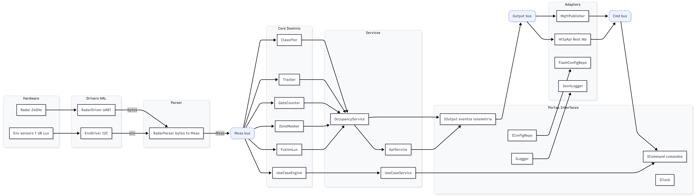

# SenseGrid — Documento de Arquitetura

> **Projeto:** SenseGrid — Mapa Vivo de Ocupação  
> **Versão:** v0.1 · **Data:** 17/10/2025  
> **Produção:** Wagner Junior · **Coord.:** Paulo Filipe (Dyona)

---

## Visão rápida

Solução de detecção e contagem de ocupação usando radar 24 GHz (ME73MS01) e sensores ambientais (T°/UR/Lux). O firmware roda em ESP32 DevKit, organiza-se por camadas e segue princípios SOLID. O sistema é agnóstico de endpoints: publica dados por MQTT e API HTTP local, mas não controla luz/ar diretamente.

---

## 1. Objetivos & KPIs (alvos do MVP)

- **Latência de evento (amostra → publicação):** < 1 s  
- **Falsos positivos/negativos (presença):** < 5 %  
- **MAE de contagem (janela 5–15 min):** ≤ 0,3 pessoa  
- **Comissionamento por ambiente (calibração inicial):** ≤ 10 min  
- **Estabilidade de ID:** sem “pulos” injustificados de identificação de alvos

---

## 2. Escopo

**Inclui:** presença (`empty/presence_still/presence_move`), contagem, rastreamento por IDs técnicos, zoneamento (máscaras/ganhos), heatmap simples, KPIs, logs `.jsonl`, calibração assistida, API local e MQTT.  
**Não inclui:** acionamento direto de dispositivos do ambiente (iluminação, ar etc.); integrações finais ficam fora do firmware (endpoint-agnostic).

---

## 3. Requisitos

### 3.1 Funcionais (RF)

- **RF-01** Detectar presença e publicar estado `empty/presence_still/presence_move`.
- **RF-02** Contar pessoas (estimativa) e publicar `count` com confiança.
- **RF-03** Rastrear alvos com IDs técnicos estáveis durante a permanência.
- **RF-04** Aplicar zoneamento: grade simples (ex.: 3×2) com máscaras e ganhos por setor.
- **RF-05** Disponibilizar API HTTP local (REST + opcional WebSocket) com leitura de estados, contagem, tracks e saúde do dispositivo.
- **RF-06** Publicar MQTT (telemetria, eventos, status, capacidades) e receber comandos (ex.: aplicar preset, iniciar calibração).
- **RF-07** Executar assistente de calibração (baseline, sensibilidade, distâncias úteis) com persistência.
- **RF-08** Registrar logs estruturados (`.jsonl`) e exportar sessão via endpoint de diagnóstico.
- **RF-09** Expor KPIs (latência, FP/FN, MAE, SNR médio, switches de ID).
- **RF-10** Carregar casos de uso (presets para sala de reunião, corredor, home-office) a partir de `configs/use_cases.v1.0.json`.

### 3.2 Não Funcionais (RNF)

- **RNF-01** Desempenho: latência < 1 s do dado à publicação.
- **RNF-02** Confiabilidade: FP/FN < 5 % em ambientes-alvo após calibração.
- **RNF-03** Portabilidade: build reproduzível (DevContainer/CI) sem dependências do PC local.
- **RNF-04** Robustez: firmware tolera ambientes com vidro, correntes de ar e iluminação variável (com apoio de sensor-fusion).
- **RNF-05** Observabilidade: logs, KPIs e tela de diagnóstico acessíveis localmente.
- **RNF-06** Segurança: sem PII; autenticação no broker e/ou token HTTP; TLS considerado para produção.
- **RNF-07** Manutenibilidade: código modular (SOLID), core desacoplado de drivers/adapters (DIP).
- **RNF-08** Persistência: configurações salvas (NVS/Flash); sobrevivem a reboot.
- **RNF-09** Comissionamento: experiência guiada ≤ 10 min por ambiente.
- **RNF-10** Compatibilidade: ESP-IDF ≥ 5.5; ESP32 DevKit (alvo INICIAL `esp32s3`; outros via “perfil de placa”).

### 3.3 Restrições e Premissas

- Radar ME73MS01 via UART (3V3).  
- Sensores ambientais via I²C (ex.: SHTC3/OPT3001, modelos equivalentes).  
- Sem ligação direta a atuadores; integração por dados (MQTT/HTTP).  
- Rede local confiável para teste; produção considera QoS adequado.

---

## 4. Arquitetura de Alto Nível

*Ideia central:* o **Core** nunca depende de bibliotecas externas; ele “vê” apenas **interfaces**. **Drivers** e **Adapters** plugam do lado de fora. (DIP do SOLID.)

[Glossário da arquitetura](./glossario_arquitetura.md)

---

## 5. Fluxos Principais

- **Aquisição** → `RadarDriver`/`EnvDriver` capturam bytes/leituras.  
- **Parsing** → `RadarParser` gera `Meas{ id, distance_cm, speed_cms, dircos_deg, pitch_deg, signal, T, RH, lux }`.  
- **Processamento** → `Classifier` emite estados; `Tracker` mantém IDs; `GateCounter` estima entradas/saídas; `ZoneMasker` aplica máscaras; `FusionLux` modula confiança; `UseCaseEngine` aplica preset.  
- **Saída** → `OccupancyService` publica `Event`s via `IOutput` (MQTT/HTTP).  
- **Comandos** → `ICommand` recebe `cmd` (ex.: `apply_use_case`, `calibrate`, `set_zone_mask`).

---

## 6. Casos de Uso (presets iniciais)

- **Sala de reunião:** histerese alta, `still_frames↑`, máscara na porta, `track.ttl_ms↑`.  
- **Corredor:** `vel_threshold↑`, gate longitudinal, `hold_ms` curto.  
- **Home-office/estações:** sensibilidade `near↑`, `still_frames↑`, ruído de ventilação suavizado por `FusionLux`.  

Presets versionados em `configs/use_cases.v1.0.json` e aplicados em *runtime*.

---

## 7. Interfaces Externas

### 7.1 MQTT (tópicos sugeridos)

**Publica:**  
`devices/{device_id}/meas` · `…/events` · `…/status` · `…/cap` · `…/kpi`  

**Assina:**  
`devices/{device_id}/cmd`  

**QoS:** `events=1`, `meas=0`. *retain* apenas em `status/cap`.

### 7.2 HTTP Local

`GET /v1/occupancy` · `GET /v1/tracks` · `GET /v1/health` · `POST /v1/cmd`  
Payloads idênticos aos do MQTT (ver **Contrato de Payload JSON v0.1**).

---

## 8. Observabilidade

- **KPIs:** latência, FP/FN, MAE, SNR, switches de ID.  
- **Logs:** `.jsonl` com `Meas`, `Event`, `KpiTick` (export via `/v1/diagnostics/export`).  
- **Heatmap:** intensidade por zona (baixa resolução) para calibração e troubleshooting.

---

## 9. Segurança & Privacidade

- **Dados:** IDs técnicos (sem PII); timestamps ISO-8601.  
- **MVP:** broker com usuário/senha e token para HTTP local.  
- **Produção:** TLS/mTLS e *hardening* de portas; auditoria de comandos.

---

## 10. Plano de Testes

- **Bancada:** sequência de medições estáticas/dinâmicas; validação de estados e latência.  
- **Multiambiente:** quarto/sala/corredor/sala de reunião; A/B com PIR.  
- **Stress:** ventilador/cortina/vidro; teste de masks/zonas.  
- **API/Integração:** contrato MQTT/HTTP validado (Mosquitto e `curl`).  

**Critérios de aceitação:** KPIs da seção 1 atingidos; presets aplicáveis; persistência ok após reboot.

---

## 11. Implantação & Comissionamento

- **Perfis de placa** (`configs/device.example.json`): mapeiam pinos (UART/I²C) e rede.  
- **Assistente de calibração:** baseline, sensibilidade, distâncias; persistência NVS.  
- **Tempo alvo:** ≤ 10 min por ambiente.

---

## 12. Riscos & Mitigações

- **Vazamento para áreas vizinhas** → máscaras e ganhos por zona; gate bem posicionado.  
- **Multipercurso/ruído** → filtros, histerese e validação em cenários reais.  
- **Lux muito baixo/ventilação** → `FusionLux` e regras de confiança.  
- **IDs instáveis** → `track.ttl_ms`, `min_dwell_frames` e reconciliação por proximidade.

---

## 13. Glossário rápido

- **Histerese:** “amortecedor” de decisão para evitar liga/desliga rápido.  
- **Gate:** linha virtual de contagem (entrada/saída).  
- **Máscara de zona:** setor ignorado (ex.: porta/corredor).  
- **SNR:** relação sinal/ruído.  
- **Track/ID:** “rastro” de um alvo; serve para estabilidade da contagem.  
- **Hold:** tempo mínimo para manter um estado antes de trocar.
